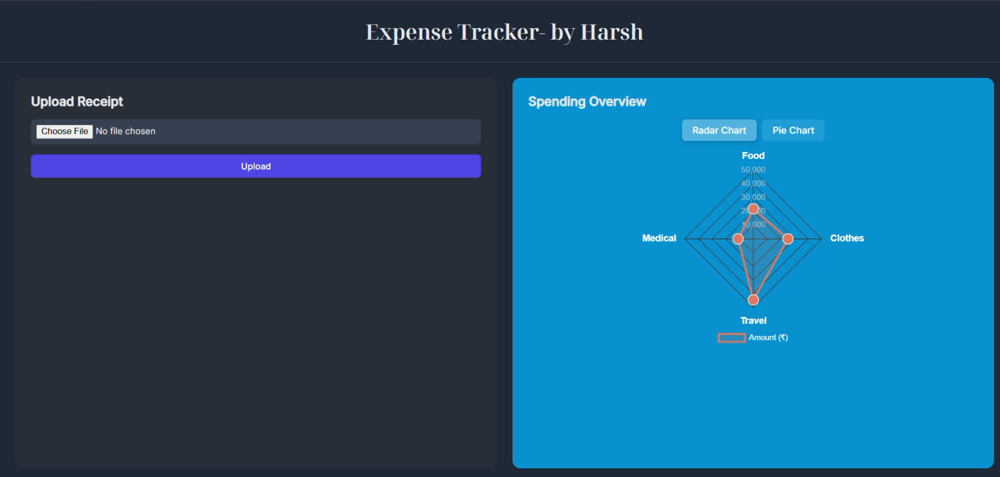
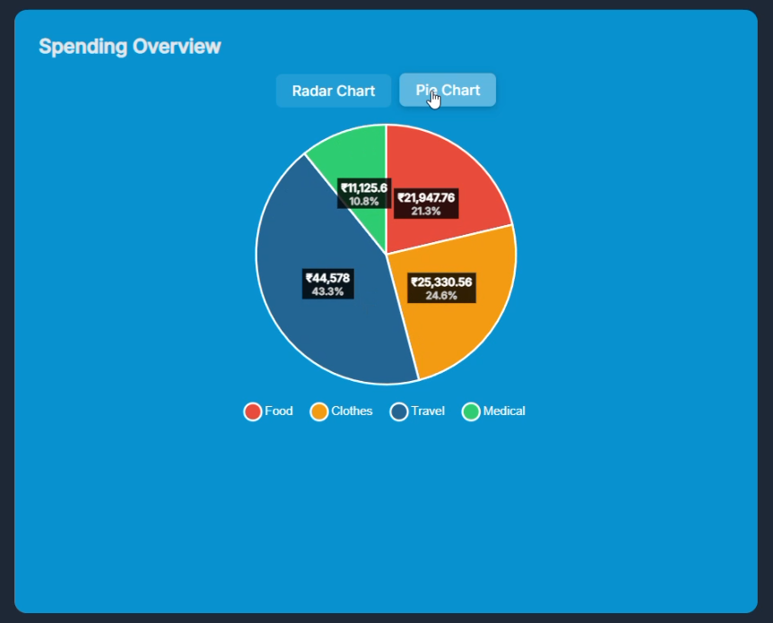
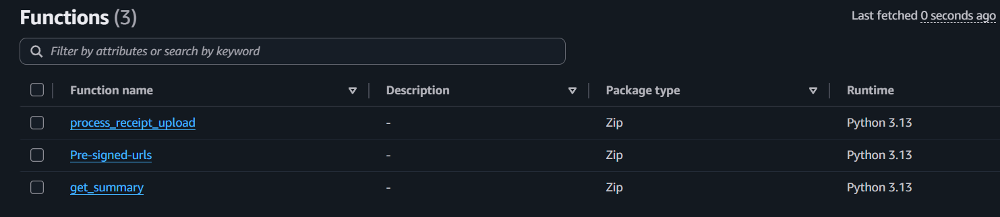
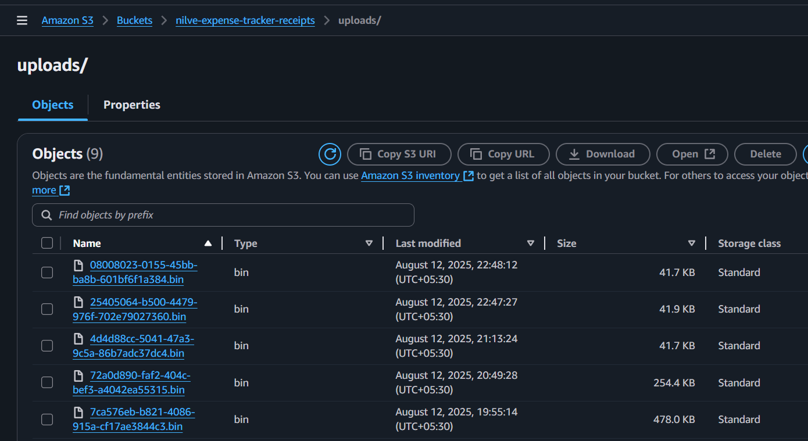
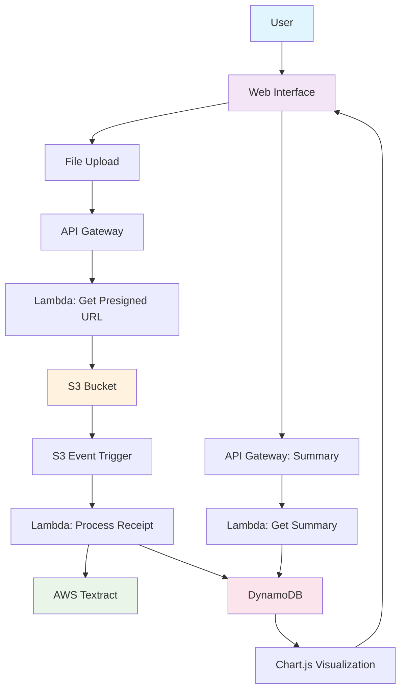

# 🧾 AWS- Expense Tracker

An intelligent expense tracking application that automatically processes receipt images using AWS services and displays spending analytics through interactive charts.

📸 Screenshots
🌐 Web Application Interface



⚡ AWS Lambda Functions Backend


☁️ Cloud S3 Bucket Storage




## 🛠️ Tech Stack

### Frontend
- **HTML5** - Structure and layout
- **CSS3** - Modern styling with CSS Grid/Flexbox
- **JavaScript** - Interactive functionality
- **Chart.js** - Data visualization (Radar & Pie charts)

### Backend & Cloud Services
- **AWS Lambda** - Serverless functions
- **AWS API Gateway** - API endpoints
- **AWS S3** - Receipt image storage
- **AWS Textract** - OCR text extraction
- **AWS DynamoDB** - NoSQL database
- **AWS IAM** - Permission management

### Deployment
- **AWS EC2** - Web hosting
- **Apache** - Web server

## 📁 Project Structure

```
expense-tracker/
├── FrontEnd
│   ├── 📄 index.html              # Main web interface
│   ├── 🎨 styles.css
│   └──⚡ app.js                  # Frontend JavaScript logic
├── 📁 lambda-functions/
│   ├── 🔧 Pre-signed_url.py            # S3 upload URLs
│   ├── 🔄 process_receipt_upload.py    # Receipt processing
│   └── 📊 get_summary.py               # Data aggregation
├── img
└── 📄 README.md
```

## 🚀 Features

### ✨ Core Functionality
- **📤 Receipt Upload** - Drag & drop or browse file upload
- **🤖 AI Text Extraction** - Automatic OCR using AWS Textract
- **🏷️ Smart Categorization** - Auto-categorizes expenses (Food, Clothes, Travel, Medical)
- **💰 Amount Detection** - Extracts total amounts from receipts
- **📊 Interactive Charts** - Toggle between Radar and Pie chart views
- **💾 Real-time Storage** - Instant data persistence in DynamoDB

### 🎯 Advanced Features
- **📈 Data Labels** - View exact amounts directly on charts
- **📱 Responsive Design** - Works on desktop and mobile
- **⚡ Scalable Architecture** - Scalable and cost-effective
- **🔐 Secure Upload** - Pre-signed URLs for direct S3 uploads

## 🏃♂️ Quick Start

### Prerequisites
- AWS Account with appropriate permissions
- EC2 instance for hosting (optional)
- Modern web browser

### 1. Clone the Repository
```bash
git clone https://github.com/harshnilve28/AWS-Expense-Tracker.git
cd expense-tracker
```

### 2. AWS Setup
1. **Create S3 Bucket** for receipt storage
2. **Set up DynamoDB table** with the provided schema
3. **Deploy Lambda functions** using the provided Python files
4. **Configure API Gateway** with the endpoints
5. **Set up IAM roles** with required permissions

### 3. Configuration
Update the API endpoints in `app.js`:
```javascript
const PRESIGN_URL = "https://your-api-gateway-url/presign";
const SUMMARY_URL = "https://your-api-gateway-url/summary";
```

### 4. Deploy
- Upload files to your web server
- Ensure proper file permissions
- Test the application

## 🔧 API Endpoints

### POST `/presign`
Generates pre-signed S3 upload URLs
```json
{
  "url": "https://bucket.s3.amazonaws.com/",
  "fields": { ... }
}
```

### GET `/summary`
Returns expense totals by category
```json
{
  "Food": 15420,
  "Clothes": 8965,
  "Travel": 3240,
  "Medical": 1250
}
```

## 🗄️ Database Schema

### DynamoDB Table: `nilve-expense-tracker-expenses`
```json
{
  "id": "uuid",
  "category": "Food|Clothes|Travel|Medical",
  "amount": "decimal",
  "timestamp": "ISO-8601",
  "raw_text": "extracted text",
  "s3_key": "receipt file path"
}
```

## 🧪 Testing

### Sample Receipts
Test the system with various receipt formats:
- Restaurant bills (Food category)
- Shopping receipts (Clothes category)
- Travel bookings (Travel category)
- Medical prescriptions (Medical category)

### Supported Formats
- **Images:** JPG, JPEG, PNG
- **Documents:** PDF (async processing)
- **File Size:** Up to 10MB per receipt

## 🔐 Security Features

- **🔒 Pre-signed URLs** - Secure direct S3 uploads
- **🛡️ IAM Roles** - Least privilege access
- **🔐 API Gateway** - Rate limiting and authentication ready
- **🚫 Input Validation** - File type and size restrictions

## 📊 Performance Metrics

- **⚡ Upload Speed:** < 3 seconds for typical receipts
- **🤖 Processing Time:** 1-2 seconds for text extraction
- **📈 Chart Rendering:** < 500ms for data visualization
- **💾 Storage Cost:** ~$0.02 per month for 100 receipts

## 👨💻 Author

**Harsh** - [Harsh Nilve]([https://github.com/yourusername](https://github.com/harshnilve28))

## 🙏 Acknowledgments

- AWS for comprehensive cloud services
- Chart.js for beautiful data visualizations
- The open-source community for inspiration

***

⭐ **Star this repository if it helped you!** ⭐
